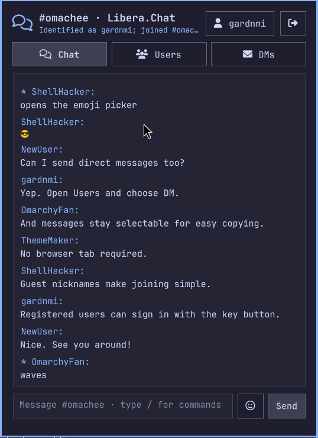
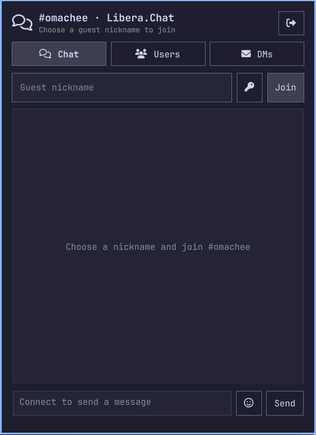

# Omarchy IRC

Join `#omachee` on Libera.Chat from a native, Omarchy-themed bar panel. Omarchy
IRC uses a bundled, standard-library-only Python helper and does not embed a web
page or browser UI.

## Preview

### Native Chat



### Simple Guest Login



## Features

- Native bar icon, connection indicator, and unread count
- Native QML timeline and bounded multiline message composer
- Separate Chat, Users, and DMs tabs
- Searchable, virtualized user roster with bounded visible results
- Mouse-selectable message text with standard `Ctrl+C` copying
- Clickable sender names with contextual DM and mute actions
- Searchable slash-command suggestions with keyboard and mouse selection
- Unicode emoji display and native Omarchy emoji-picker input
- Channel member selector populated from IRC `NAMES` replies
- Direct-message conversations with individual channel members
- Session-only mute and unmute controls for incoming user messages
- Guest nicknames and optional session-only NickServ login with SASL PLAIN
- Verified TLS connection to `irc.libera.chat:6697`
- Automatic PING/PONG and bounded exponential reconnect backoff
- Session-only messages that disappear when Omarchy shell restarts
- Plain-text rendering for messages and notices
- Outgoing IRC line-limit checks and one-message-per-second throttling
- Compact join, part, quit, nickname, and connection notices
- Server-authorized operator controls with confirmed kick and ban actions
- `/me` actions rendered as plain text; other CTCP commands ignored

## Requirements

- Omarchy with the Quattro shell plugin system
- Python 3 available on `PATH`
- Network access to `irc.libera.chat` on TCP port `6697`

## Install

Review the source before installing. Omarchy plugins run as unsandboxed code
inside the long-running shell process, and this plugin starts its bundled Python
helper on first panel open.

```bash
omarchy plugin add https://github.com/gardnmi/omarchy-irc.git --enable
```

If needed, enable it later:

```bash
omarchy plugin enable io.github.gardnmi.omarchy-irc --section right
```

Open the chat icon, choose a guest nickname, and select **Join**. The default
form does not ask new users about IRC accounts. Experienced users can select the
key icon beside **Join** to reveal a masked password field and identify with a
registered Libera.Chat account such as `gardnmi`; selecting it again returns to
the simple guest flow. **Chat** is the
fixed `#omachee` channel with no channel dropdown. **Users** contains a searchable
virtualized roster with DM and mute actions. It keeps all known nicknames as
lightweight strings but renders at most 250 matching rows at once, so channels
with thousands of users remain responsive. **DMs** contains private
conversations and uses a selector for the available private conversations.

The login form is shown only until the channel is joined. Afterward,
the active nickname appears as a clickable header control; select it to reveal a
compact Apply/Cancel nickname editor. `/nick newname` remains available from the
composer.

After an authenticated account joins, the helper automatically asks ChanServ for
temporary operator status. ChanServ grants it only when that account has channel
access. While the server reports `@` for the current nickname, the Users tab
displays **Kick** and **Ban + kick** actions. Both require confirmation; ban first
checks WHOIS and uses a NickServ account mask when available, otherwise it falls
back to a nickname mask. The helper independently checks the live `@` state and
does not expose arbitrary IRC mode commands.

Enter sends from the composer. `Shift+Enter` or `Ctrl+Enter` inserts a newline.
Because IRC framing cannot contain CR/LF, the plugin encodes composer breaks as
Unicode LINE SEPARATOR characters so they remain one IRC message and render on
separate lines in compatible clients. **Change** updates the nickname. The
compact leave icon in the header parts the channel and closes the connection.

Drag across any message body to select plain text, then press `Ctrl+C` to copy
the selection. Click another user's nickname in the timeline to reveal **DM**
and **Mute/Unmute** actions directly beneath that message. Clicking the name
again dismisses the actions.

The composer supports these local slash commands without forwarding arbitrary
raw IRC commands:

| Command | Action |
| --- | --- |
| `/me action` | Send an IRC action to the active channel or DM |
| `/action action` | Alias for `/me` |
| `/dice [sides]` | Roll a die, defaulting to six sides, and send the result as an action |
| `/msg nick message` | Open a DM and optionally send a message |
| `/query nick` | Open a DM without sending |
| `/nick nick` | Change the current nickname |
| `/mute nick` | Suppress subsequent incoming messages from a nickname |
| `/unmute nick` | Remove a session mute |
| `/clear` | Clear the active conversation from shell memory |
| `/part` or `/quit` | Leave `#omachee` and disconnect |
| `/join #omachee` | Report the fixed channel's current join state |
| `/help` | Show the supported command list |

Start a message with `//` to send a literal leading slash.
Typing `/` opens the supported-command list. Continue typing to filter it, use
Up/Down to move, and press Enter or Tab to insert the selected command. Commands
can also be selected with the mouse; Escape dismisses the list.

Choose the smiley icon beside the composer to open Omarchy's searchable emoji overlay.
Selecting an emoji inserts it into the focused composer without sending it;
continue typing or press Enter to send. The standard `SUPER+CTRL+E` Omarchy
shortcut opens the same picker. Received Unicode emoji use the system emoji font
fallback, normally `Noto Color Emoji` on Omarchy.

Kiwi IRC's optional emoticon renderer sends ASCII tokens over IRC and replaces
them with emoji only inside Kiwi. For compatibility, the panel applies the same
display-only conversion to common whitespace-delimited tokens, including
`8)` to `😎`, `:)` to `🙂`, and `<3` to `❤`. The raw IRC text remains unchanged
in the session timeline and is never rewritten before protocol handling.

URLs remain plain text in the initial release. The panel does not automatically
open, fetch, preview, or execute links or message content.

## Connection And Privacy

The bundled `irc_helper.py` connects directly to the fixed host
`irc.libera.chat:6697` with Python's default verified TLS trust store. It sends
the selected nickname, a generic IRC user description, channel messages, and
protocol traffic required to join and remain connected to `#omachee`.

The helper starts only after the panel is opened for the first time. It remains
connected while Omarchy shell runs, including while the panel is closed. QML and
the helper communicate through newline-delimited JSON on local process pipes.
The plugin does not write chat history, nicknames, credentials, or connection
state to disk. Direct-message conversations and the muted-user set also remain
only in QML memory. Restarting Omarchy shell discards all of them. Muting is a
local presentation action: Libera still delivers the traffic, but the panel
does not retain or display subsequent messages from that nickname.

The session keeps at most 100 distinct DM conversation targets so unsolicited
messages from rotating nicknames cannot grow the dropdown without bound.

The timeline retains the newest 500 total channel messages, DM messages, and
connection/user notices by default. The optional `maxTimelineEntries` plugin
setting changes this session-memory cap, with a minimum of 100 entries. The cap
is global across all conversations rather than 500 entries per DM.

NickServ passwords are accepted only through the masked login field, sent to the
helper over its local stdin pipe, and used for SASL PLAIN inside the verified TLS
connection. They remain in process memory only while needed for reconnects and
are cleared when leaving or when authentication fails. Authentication must
succeed before the helper joins `#omachee`; it never silently falls back to a
guest after an authentication failure. If another IRC client already holds the
requested registered nickname, account login stops with instructions to
disconnect that client instead of joining under a suffix. When no password is
supplied, registered nickname notices still trigger a random guest suffix.

There are no analytics, telemetry, public logs, bots, bridges, embedded browsers,
or LLM processing. Libera.Chat and other channel participants receive normal IRC
traffic; consult Libera.Chat's policies before use.

## Protocol Boundary

Commands sent to the helper include:

```json
{"command":"connect","nickname":"gardnmi","account":"gardnmi","password":"<session-only>"}
{"command":"send","target":"#omachee","text":"Hello from Omarchy"}
{"command":"send","target":"someone","text":"Hello privately"}
```

Events returned to QML include:

```json
{"event":"message","nick":"someone","target":"#omachee","text":"Welcome!"}
{"event":"message","nick":"someone","target":"someone","text":"Private hello"}
{"event":"names","channel":"#omachee","users":["someone","another-user"]}
{"event":"connected","channel":"#omachee","network":"Libera.Chat"}
{"event":"error","message":"Nickname already in use"}
```

The helper handles SASL PLAIN capability negotiation and the IRC messages needed
for `JOIN`, channel and direct `PRIVMSG`, `NOTICE`, `NICK`, `PART`, `QUIT`,
`PING`, `NAMES`, channel names, and connection numerics. Direct-message targets
must pass the same nickname validation as the local guest nickname. Malformed
IPC and IRC lines are rejected or ignored without evaluating their contents.

## Update And Remove

```bash
omarchy plugin update io.github.gardnmi.omarchy-irc
omarchy plugin remove io.github.gardnmi.omarchy-irc
```

Removing the plugin stops its helper when Omarchy reloads the plugin. No history
or credentials remain to remove.

## Development

```bash
mise run test
mise run validate
mise run restart
omarchy-shell io.github.gardnmi.omarchy-irc open
```

The tests exercise IRC parsing, malformed input, Unicode, line limits, JSON IPC,
nickname collisions, SASL negotiation, operator authorization, account-aware
bans, emoji Unicode, member-list parsing, and direct-message routing without
connecting to Libera.Chat. A release smoke test should use disposable nicknames
to verify connect, join, channel and direct sends, mute/unmute, part, reconnect,
unread state, shell restart, responsive layout, and plugin removal.

## License

[MIT](LICENSE)
